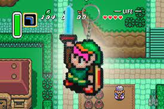

  

<h3 align="center">Zelda mini clone</h3>

<!-- 

 -->

---

 A zelda clone using java.
      

## 📝 Table of Contents

- [About](#about)
- [Getting Started](#getting_started)
- [Built Using](#built_using)
- [Authors](#authors)

## 🧐 About 

Curso introdutório de desenvolvimento de games usando java.

<!--
## 🏁 Getting Started 

These instructions will get you a copy of the project up and running on your local machine for development and testing purposes. See [deployment](#deployment) for notes on how to deploy the project on a live system.

## ⛏️ Built Using 

- [MongoDB](https://www.mongodb.com/) - Database
- [Express](https://expressjs.com/) - Server Framework
- [VueJs](https://vuejs.org/) - Web Framework
- [NodeJs](https://nodejs.org/en/) - Server Environment -->

## ✍️ Authors 

- [@ThiagoKS-7](https://github.com/ThiagoKS-7) - Idea & Initial work
